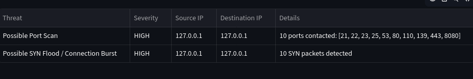
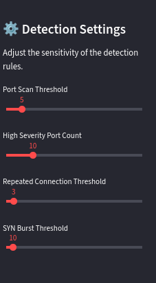
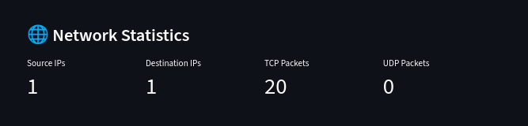

# Network Security Monitoring & Threat Detection

A Python-based network security monitoring tool that analyzes network traffic, detects suspicious activity, and presents security findings through an interactive Streamlit dashboard.

---

## Overview

This project supports both **PCAP/PCAPNG file analysis** and **live network traffic capture**. It analyzes network packets, extracts important networking information, and uses rule-based detection techniques to identify suspicious network behavior.

The project focuses on detecting activities such as:

- Port scanning
- Repeated connection attempts
- TCP SYN bursts
- Suspicious connection patterns

The analysis results are displayed through network statistics, protocol analysis, detected threats, severity levels, and security reports.

---

## Objectives

- Analyze network traffic.
- Perform packet-level analysis.
- Extract important packet information.
- Detect suspicious network activity.
- Detect possible port scans.
- Detect repeated connection attempts.
- Detect abnormal TCP SYN bursts.
- Classify detected threats by severity.
- Provide network traffic statistics.
- Support PCAP and PCAPNG analysis.
- Support live network packet capture.
- Provide an interactive Streamlit dashboard.
- Generate security reports.

---

## Features

### 1. Network Traffic Analysis

The system analyzes network traffic from:

- PCAP files
- PCAPNG files
- Live network captures

Important information such as IP addresses, ports, protocols, and TCP flags is extracted during analysis.

### 2. Packet Analysis

The project uses Scapy to inspect network packets and extract information including:

- Source IP
- Destination IP
- Source Port
- Destination Port
- Protocol
- TCP Flags

### 3. Network Statistics

The dashboard provides information about:

- Unique source IP addresses
- Unique destination IP addresses
- TCP packet count
- UDP packet count
- Overall network traffic activity

### 4. Protocol Analysis

The system analyzes network traffic based on protocols.

Currently, the project provides analysis for:

- TCP
- UDP

### 5. Port Scan Detection

The system analyzes TCP SYN packets and tracks destination ports contacted by a source.

When a source attempts connections to multiple destination ports beyond the configured threshold, the system generates a possible port scan alert.

### 6. Repeated Connection Detection

The system detects repeated connection attempts between the same source and destination.

Repeated attempts are tracked using:

- Source IP
- Destination IP
- Destination Port

When the configured threshold is exceeded, a suspicious activity alert is generated.

### 7. SYN Burst Detection

The system analyzes TCP SYN packets and detects unusually high numbers of connection attempts.

When the SYN packet count exceeds the configured threshold, the system generates a possible SYN burst or connection flood alert.

### 8. Configurable Detection Settings

The detection thresholds can be configured through the Streamlit dashboard.

Available settings include:

- Port Scan Threshold
- High Severity Port Count
- Repeated Connection Threshold
- SYN Burst Threshold

### 9. Threat Severity Classification

Detected activities are classified based on severity.

The current implementation uses:

- HIGH
- MEDIUM
- LOW

### 10. Streamlit Dashboard

The interactive Streamlit dashboard allows users to:

- Upload PCAP/PCAPNG files
- Analyze network traffic
- Capture live network traffic
- View network statistics
- View protocol analysis
- View detected threats
- Configure detection thresholds
- View threat severity
- Generate security reports

### 11. Live Network Capture

The project can capture network packets from a selected local network interface.

The captured traffic is then analyzed using the same packet analysis and threat detection rules.

### 12. Security Report Generation

The system generates security reports containing analysis results and detected threats.

Reports may include:

- Number of packets analyzed
- Network statistics
- Detected threats
- Threat severity
- Detection details
- Security findings

---

## How It Works

```text
                     Network Traffic
                            |
              +-------------+-------------+
              |                           |
       PCAP / PCAPNG File             Live Capture
              |                           |
              +-------------+-------------+
                            |
                            v
                     Packet Analysis
                            |
                            v
                 Network Traffic Analysis
                            |
              +-------------+-------------+
              |                           |
       Network Statistics          Protocol Analysis
                            |
                            v
                   Threat Detection Rules
                            |
          +----------------+----------------+
          |                |                |
      Port Scan      Repeated Connection    SYN Burst
      Detection          Detection          Detection
          |                |                |
          +----------------+----------------+
                            |
                            v
                  Severity Classification
                            |
                            v
                   Streamlit Dashboard
                            |
                            v
                     Security Report
```

---

## Project Structure

```text
Network-Security-Monitor/
│
├── app.py
├── README.md
├── requirements.txt
├── .gitignore
│
├── data/
│   ├── sample.pcap
│   ├── portscan_test.pcap
│   └── repeated_test.pcap
│
├── reports/
│
└── src/
    └── main.py
```

---

## Technologies Used

- Python
- Scapy
- Streamlit
- Pandas
- Matplotlib
- TCP/IP Networking
- PCAP Analysis
- Kali Linux
- Git
- GitHub

---

## Requirements

Before running the project, make sure the following are installed:

- Python 3
- pip
- Git

Install the required Python dependencies using:

```bash
pip install -r requirements.txt
```

---

## Installation

### 1. Clone the Repository

```bash
git clone https://github.com/Lokeshd-25/Network-Security-Monitor.git
```

### 2. Navigate to the Project Directory

```bash
cd Network-Security-Monitor
```

### 3. Create a Virtual Environment

```bash
python3 -m venv venv
```

### 4. Activate the Virtual Environment

#### Linux / Kali Linux

```bash
source venv/bin/activate
```

#### Windows

```bash
venv\Scripts\activate
```

### 5. Install Dependencies

```bash
pip install -r requirements.txt
```

---

# 📸 Dashboard Screenshots

## 🚨 Detected Threats



## ⚙️ Detection Settings



## 📊 Network Statistics



---

## How to Run

Start the Streamlit dashboard using:

```bash
streamlit run app.py

```

After starting the application, Streamlit will display a Local URL in the terminal.

Open the displayed URL in your browser.

The application usually runs at:

```text
http://localhost:8501
```

---

## How to Use the Dashboard

### Analyze a PCAP/PCAPNG File

1. Start the Streamlit application.
2. Open the Local URL displayed in the terminal.
3. Upload a PCAP or PCAPNG file.
4. The system analyzes the packets.
5. View network statistics.
6. View protocol analysis.
7. View detected threats.
8. View threat severity levels.
9. Generate the security report.

---

### Perform Live Network Capture

1. Start the Streamlit dashboard.
2. Select a network interface.
3. Select the capture duration.
4. Start the live network capture.
5. The system captures network packets.
6. The captured traffic is analyzed.
7. View network statistics and detected threats.

---

### Configure Detection Settings

The following detection thresholds can be configured from the dashboard:

```text
Port Scan Threshold
High Severity Port Count
Repeated Connection Threshold
SYN Burst Threshold
```

---

## Example Analysis

The system analyzes network traffic and identifies suspicious patterns.

Examples of detected activities include:

```text
Threat: Possible Port Scan
Severity: HIGH
```

```text
Threat: Possible Repeated Connection Attempts
Severity: MEDIUM
```

```text
Threat: Possible SYN Flood / Connection Burst
Severity: HIGH
```

---

## Test Results

| Test | Status |
|---|---|
| PCAP File Analysis | Successful |
| Port Scan Detection | Successful |
| Repeated Connection Detection | Successful |
| SYN Burst Detection | Successful |
| Network Statistics | Successful |
| Protocol Analysis | Successful |
| Streamlit Dashboard | Successful |
| Security Report Generation | Successful |

---

## Security Relevance

This project demonstrates practical cybersecurity concepts including:

- Network Security Monitoring
- Packet Analysis
- TCP/IP Networking
- Port Scan Detection
- Connection Pattern Analysis
- Rule-Based Threat Detection
- Threat Severity Classification
- Security Reporting

---

## Limitations

- Detection is rule-based.
- Only selected suspicious network patterns are currently analyzed.
- Detection thresholds may require adjustment depending on the network environment.
- Alerts may require manual investigation.
- A detected alert does not automatically confirm an attack.
- The project does not replace enterprise IDS, IPS, or SIEM platforms.

---
## Author

**Lokesh D**

---

## Disclaimer

This project is developed for educational and cybersecurity research purposes only.

Network traffic should only be captured and analyzed on systems and networks for which proper authorization has been obtained.
